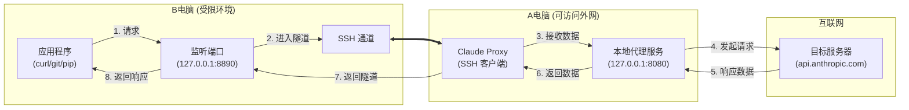
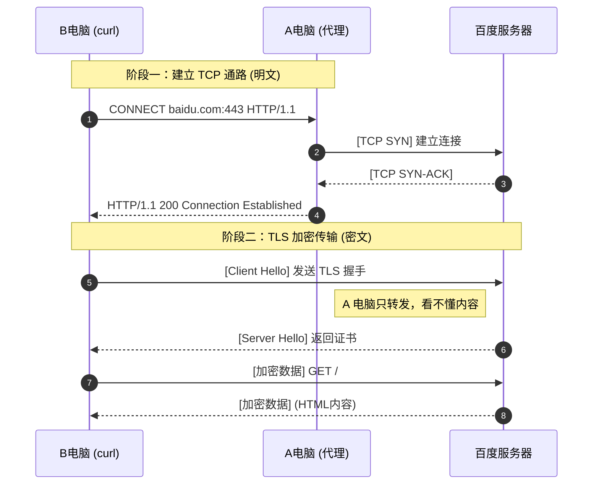
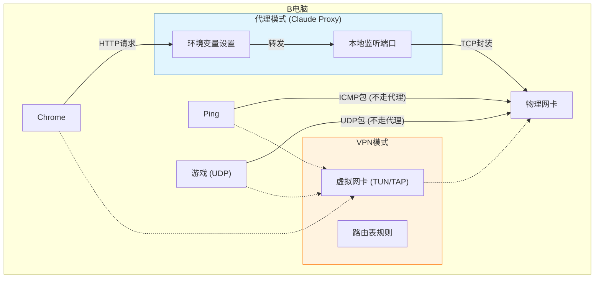
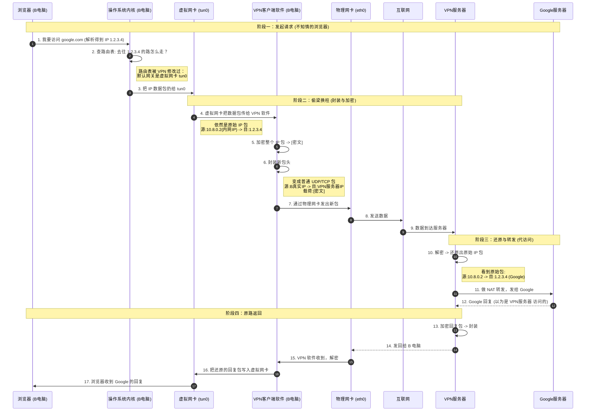

# Claude Proxy 技术原理深度解析

本文档详细解释了 Claude Proxy 的工作原理、与 VPN 的区别、HTTPS 穿透机制以及在企业内网中的应用场景。

## 1. SSH 反向代理原理 (Reverse Tunneling)

**核心概念**：利用 A 电脑（外网可达）作为跳板，让内网受限的 B 电脑能够访问互联网。

### 关键步骤：
1.  **建立隧道**：Claude Proxy (A) 主动连接 B 电脑的 SSH 服务，并请求**反向端口转发** (`-R`)。
2.  **只有 TCP**：目前仅支持 TCP 协议，不支持 UDP（如 DNS 查询、QUIC）。
3.  **身份伪装**：对于目标服务器来说，访问者是 A 电脑，B 电脑是完全隐形的。

---

## 2. HTTPS 穿透流程 (The "CONNECT" Method)

当 B 电脑请求 HTTPS 网站（如 `https://baidu.com`）时，发生的是**盲传**。

*   **A 电脑角色**：拨线员 + 搬运工。
*   **隐私性**：A 电脑只能看到你访问了 *哪个域名* (baidu.com)，但无法通过抓包看到你 *请求的具体路径* 或 *页面内容*。

---

## 3. Proxy vs VPN：核心区别

| 特性 | Proxy (Claude Proxy) | VPN (虚拟专用网) |
| :--- | :--- | :--- |
| **工作层级** | 应用层/会话层 (L7/L5) | 网络层 (L3) |
| **比喻** | **代购** (你把清单给他) | **修路** (把家门口的路改了) |
| **适用范围** | 仅限支持代理的软件 (浏览器, curl) | 全局所有软件 (系统更新, 游戏) |
| **协议支持** | 通常仅 TCP (SOCKS5 可支持 UDP) | 全协议 (TCP/UDP/ICMP/Ping) |
| **配置方式** | 每个软件单独配 (`export HTTP_PROXY`) | 连接后自动接管整个系统 |
| **UDP支持** | **不支持** | **支持** (适合游戏、DNS) |

### VPN 工作流程详解 (https://google.com)

VPN 通过虚拟网卡劫持整个操作系统的网络流量。

